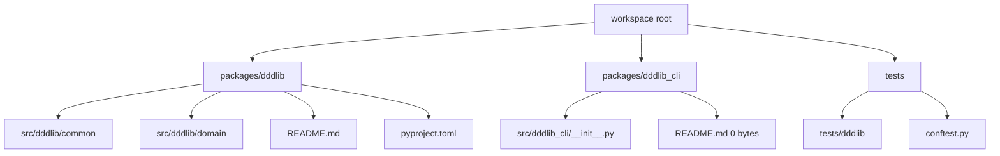

# dddlib ライブラリ評価レポート

## エグゼクティブサマリー

urldddlib リポジトリturn0view0 は、DDD のドメイン層で繰り返し現れる基礎要素を薄く提供することを狙った、非常に初期段階の Python ライブラリです。公開 README では、値オブジェクト、エンティティ、集約ルート、ドメインイベント、識別子、エラー、メッセージを対象とする「薄い基盤層」であり、フレームワークではないと明言されています。一方で、2026年5月11日時点で確認できる活動は 2026年5月10日の初回コミット 1 件のみで、release はなく、open issue は 4 件、PR は 0 件、star / fork / watcher も 0 です。したがって、発想自体は筋が良いものの、現時点では「採用候補の完成ライブラリ」ではなく、「設計メモを伴う試作ライブラリ」と評価するのが妥当です。citeturn33view3turn6view1turn6view0turn25view0

結論を先に言うと、本番採用の判定は **avoid** です。理由は、機能範囲の説明はあるが実運用に必要な公開 API 例、インストール手順、API リファレンス、リリース運用、継続的な保守実績が不足していること、CLI パッケージが実質プレースホルダに見えること、そしてワークスペース全体が entity["software","Python","programming language"] 3.14 以上を要求しており適用可能な環境が限定されることです。採用するなら「内部スパイク」か「学習用」の範囲に留めるべきで、少なくとも安定リリース、CI、テスト実績、導入ガイドが揃うまでは業務基盤の依存先にすべきではありません。citeturn5view1turn11view0turn11view2turn11view3turn25view0

## 調査対象と一次ソース

本レポートは、公開されている一次ソースを優先して評価しています。主な参照先は、urlリポジトリ front pageturn0view0、urlルート README.ja.mdhttps://github.com/pochinoritaro/dddlib/blob/main/README.ja.md、urlルート pyproject.tomlhttps://github.com/pochinoritaro/dddlib/blob/main/pyproject.toml#L1-L140、urlpackages/dddlib README.mdhttps://github.com/pochinoritaro/dddlib/blob/main/packages/dddlib/README.md、urlpackages/dddlib ディレクトリhttps://github.com/pochinoritaro/dddlib/tree/main/packages/dddlib、urlpackages/dddlib/src/dddlib ディレクトリhttps://github.com/pochinoritaro/dddlib/tree/main/packages/dddlib/src/dddlib、urlpackages/dddlib_cli README.mdhttps://github.com/pochinoritaro/dddlib/blob/main/packages/dddlib_cli/README.md、urltests ディレクトリhttps://github.com/pochinoritaro/dddlib/tree/main/tests、urlLICENSE.mdhttps://github.com/pochinoritaro/dddlib/blob/main/LICENSE.md#L1-L21、urlコミット履歴turn2view6、urlIssues 一覧turn2view7 です。citeturn5view3turn30view3turn33view3turn6view2turn9view1turn5view1turn9view2turn5view4turn6view1turn6view0

未確認のものも明示しておきます。`packages/dddlib/pyproject.toml` と `packages/dddlib_cli/pyproject.toml` はディレクトリ上の存在は確認できますが、内容までは取得できていないため、配布パッケージとしての正確なメタデータ、runtime dependency、entry point、publish 設定は **unspecified** です。これはライブラリ評価上の重要な不確実性です。citeturn6view2turn6view3

## 目的とスコープ

ルート README と `packages/dddlib/README.md` を読む限り、本ライブラリの目的は、DDD のドメイン層でよく使う概念を共通基盤として整えることです。対象は値オブジェクト、エンティティ、集約ルート、ドメインイベント、識別子、ドメインエラー、メッセージであり、業務固有のロジックやアプリケーション固有処理は持たない、あくまで「薄い基盤層」として位置付けられています。そのため、フルスタックの DDD フレームワークやテンプレートではなく、「ドメインモデルの書き方を整える共通部品集」という理解が適切です。citeturn5view3turn33view3

このスコープ設定自体は明快です。特に「値オブジェクト」「識別子」「集約ルート」「ドメインイベント」「エラー表現」を揃える方針は、DDD の tactical pattern の最小集合として筋が通っています。他方で、公開ドキュメント上ではリポジトリ、永続化、アプリケーションサービス、トランザクション、メッセージバス、外部 I/O、Web 統合などは明示的に扱っていません。したがって、これを採用しても DDD アプリケーション全体が完成するわけではなく、導入効果は主にドメインモデルの表現統一に限られます。citeturn33view3

この点は強みでもあり弱みでもあります。強みは、ライブラリが過剰に領域を広げていないため、設計哲学がぶれにくいことです。弱みは、ユーザーが期待しがちな「DDD を始めるための周辺一式」が現時点では提供されていないことです。特にルート README は詳細を各パッケージ README に委譲していますが、`dddlib_cli` 側 README は 0 bytes で、委譲先が成立していません。これは「設計上の分離」はあるが「利用者向けの完成度」は未達ということを意味します。citeturn5view3turn5view1turn6view3

## アーキテクチャと公開 API

公開ツリーから確認できる構成は、ルートのワークスペース配下に `packages/dddlib`、`packages/dddlib_cli`、`tests` があり、ライブラリ本体の `src/dddlib` の下は `common`・`domain`・`__init__.py` に分かれています。少なくとも名前空間レベルでは、「共通部品」と「ドメイン概念」の責務分割を意識した構成です。CLI は別パッケージに切り出されており、ライブラリ本体と CLI の責務を分離しようとする設計意図は読み取れます。citeturn6view2turn9view1turn6view3

上の構成図は、公開ディレクトリツリーから確認できる範囲だけで再構成したものです。実装の内訳まではたどれていないため、`common` と `domain` の下にどの程度のモジュール粒度があるかは **unspecified** です。citeturn9view1turn9view0turn9view2

公開 API の使いやすさについては、概念名はかなり良いです。README から見える API 名称として `FrozenBase`、`UUIDIdentifier`、`DDDError`、`Message`、`DDDMessage` があり、どれも DDD の用語に沿っていて役割が推測しやすく、ドメイン言語との距離が近い名前付けです。値オブジェクトは `FrozenBase` による不変性、識別子は `UUIDIdentifier`、ドメイン失敗は `DDDError` という整理は、概念としては理解しやすいです。citeturn33view3

しかし、人が「使える API」になっているかという観点では評価を落とします。理由は、README にインストール節、import 例、最小サンプル、典型ユースケースのコード、API リファレンスへの導線がほぼなく、概念説明が先行しているからです。用語は明快でも、`__init__.py` の再公開面、型シグネチャ、継承パターン、復元用 factory の使い方、例外設計の契約などが見えません。このため、**名称の ergonomics は良いが、オンボーディング ergonomics は弱い**というのが実務的な評価です。citeturn33view3turn5view1

## 機能の完成度と実装品質

### 機能の完成度

README に書かれた機能一覧だけを見ると、ライブラリの核は「ドメイン層の tactical patterns を揃えること」に集中しています。値オブジェクト、エンティティ、集約ルート、ドメインイベント、識別子、エラー・メッセージという並びは一貫しており、目的自体はぶれていません。導入順序まで示している点も親切で、識別子 → 値オブジェクト → エンティティ / 集約 → イベント / エラーという採用順は、新規ドメインモデルへ段階的に導入する考え方として妥当です。citeturn33view3

ただし、完成度はまだ低いです。CLI パッケージは README が空で、`src/dddlib_cli` には `__init__.py` しか見えません。issue も「dddlib開発」「dddlib_cli開発」「テンプレート生成コマンド」「依存性逆転検知コマンド」と、コアと周辺がまだ roadmap 段階にあることを示しています。少なくとも「ライブラリ本体が安定し、その上に CLI が整備されている」状態には達していません。citeturn5view1turn9view0turn6view0

### コード品質

コードそのものの可読性は、深いソースファイルまで確認できていないため **implementation-level では unspecified** です。ただし、品質方針の意図は明確です。ワークスペース設定では、entity["software","Ruff","Python linter and formatter"] の `select = ["ALL"]`、`target-version = "py314"`、entity["software","mypy","Python static type checker"] `strict = true`、entity["software","pytest","Python testing framework"] と `pytest-cov` の利用が宣言されており、静的解析とテストを厳しめに回したい意図ははっきりしています。`tests` 配下に `tests/dddlib` と `conftest.py` があるため、少なくともテスト構造を置くところまでは進んでいます。citeturn11view0turn11view2turn11view3turn9view2

一方で、設定には気になる点もあります。`[tool.pyright]` で `reportGeneralTypeIssues = "none"` になっており、entity["software","Pyright","Python static type checker"] の一般的な型エラー報告を抑制しています。また、dev dependencies には mypy は入っている一方、Pyright 自体は見えていません。つまり、「型安全を強く重視する」というメッセージの裏で、型チェックの運用ポリシーはまだ整理途上に見えます。加えて、CI 設定や公開カバレッジ結果は確認できないため、**品質ゲートの意図は強いが、実績はまだ見えない**という評価になります。citeturn10view0turn11view0turn11view2turn11view3

### 依存関係と互換性

互換性面で最も大きいのは、ルートの `pyproject.toml` が entity["software","Python","programming language"] `>=3.14` を要求し、`Ruff` の target も `py314` に固定されていることです。Python 3.14 は 2025年10月に安定版として公開済みですが、2026年5月時点でも多くの組織では 3.12 / 3.13 が主流である可能性が高く、`>=3.14` は導入障壁になります。特にこのライブラリのスコープは「薄い基盤層」なので、3.14 固有機能を使う必然性が README からは読み取れず、互換性コストの割に得られる便益が見えません。citeturn11view0turn35search3turn35search5

外部依存については、公開 root metadata から確認できるのは dev group の `mypy`, `pytest`, `pytest-cov`, `pytest-mock`, `ruff` です。`dddlib` パッケージ自体の runtime dependencies は package-local `pyproject.toml` 未確認のため **unspecified** ですが、README の語り口と root workspace だけを見る限りでは、重い依存を前提にした設計には見えません。つまり、依存面は「軽そう」ではあるものの、**断定できる一次ソースが不足している**というのが正確です。citeturn11view0turn6view2

### 性能特性

性能について、公開ソースから定量評価できる材料はありません。README 全体にベンチマーク、スループット比較、メモリ特性、Big-O の説明、ホットパスの最適化方針は見当たらず、CI 上の実測値も確認できません。そのため、**測定可能な性能特性は unspecified** と判断するのが適切です。citeturn33view3

もっとも、README が「薄い基盤層」「フレームワークではない」と説明していることから、理論上のランタイムオーバーヘッドは大きくない可能性があります。ただし、それはあくまで設計意図からの推測であり、現時点では「軽量であると期待できる」以上のことは言えません。性能が要求事項に入るなら、採用前に必ず自前ベンチマークで確認すべきです。citeturn33view3

### ドキュメント品質

ドキュメントの長所は、ルートと `packages/dddlib` の双方で英語 / 日本語の README が用意されていることです。これは開発者体験として好印象で、コンセプト説明の文章も全体として落ち着いています。一方で、品質は「概念説明としては良いが、利用ガイドとしては不足」です。特に `packages/dddlib/README.md` は Positioning、Design Policy、Provided Features、Typical Usage Image、Adoption Approach といった conceptual な章立てで、インストール手順、サンプルコード、API docs へのリンク、FAQ、制約事項、バージョン互換表がありません。`dddlib_cli` README が 0 bytes なのも、この印象を強めます。citeturn5view3turn33view3turn5view1

テストや実行手順についても、README から直接使えるコマンドはほぼ提示されていません。ただし root `pyproject.toml` の workspace 設定と `pytest` 設定から推測すると、標準的な再現手順は「Python 3.14 を用意し、`uv` ワークスペースとして依存を同期し、`pytest` を実行する」流れになるはずです。具体的には、**推定される**最短手順は `uv sync --group dev` の後に `uv run pytest` です。とはいえ、これは公開設定からの推定であり、README に明記された公式手順ではありません。公開情報上、実行結果やカバレッジ実績値は未提示です。citeturn10view1turn11view2turn11view3

## 保守性・法務・セキュリティ・導入難易度

### 保守状況とコミュニティ

保守性の最大の論点は、**まだ継続保守の実績が形成されていない**ことです。可視なコミット履歴は 2026年5月10日の `first commit` 1 件のみで、同日にオーナー自身が 4 件の issue を開いています。これを前向きに捉えれば、着手直後で roadmap を明示している状態です。逆に言えば、持続的な開発周期、レビュー運用、バグ修正速度、後方互換ポリシー、利用者フィードバックへの応答性は、まだ何も検証できません。citeturn6view1turn6view0

コミュニティ指標も初期状態です。front page では star 0、fork 0、watching 0、release なし、PR 0 と表示されており、外部 traction は現時点で観測できません。open source ライブラリとしては「見つけやすさ」「信頼の社会的証拠」「外部レビュー」のいずれもこれから、という段階です。citeturn25view0turn5view6

参考までに、issue は `dddlib開発`、`dddlib_cli開発`、`pyproject.tomlからプロジェクトテンプレートを作成するコマンド`、`依存性逆転を検知するコマンド` で、コアの安定化よりも先に CLI 機能やテンプレート生成の話題も混在しています。これは将来像としては面白いものの、スコープ管理がまだ定まっていない可能性も示します。citeturn6view0

### ライセンスと法務

ライセンスは MIT で、法務上の制約は比較的緩いです。商用利用、改変、再配布の自由度は高く、一般的な社内採用の観点では扱いやすい部類です。著作権表示は `Copyright (c) 2026 kazuma tunomori` です。citeturn5view4turn7view3

ただし、法務運用の整備は薄いです。top-level tree には `LICENSE.md` はあるものの、`CONTRIBUTING.md`、`CHANGELOG.md`、`CODE_OF_CONDUCT.md`、`SECURITY.md`、`.github/workflows` は確認できません。厳密には「存在しない」とまでは言い切らず、見えている top-level 表面に限る評価ですが、少なくとも利用者やコントリビュータ向けの運用文書は未整備に見えます。citeturn25view0

### セキュリティ

セキュリティ面では、front page に `Security and quality 0` と表示されており、表面上はセキュリティ機能の可視化が行われていません。また、top-level tree からは `SECURITY.md` や issue reporting policy も見えません。脆弱性情報、開示ポリシー、署名済み release、SBOM、依存スキャン、CI 連携の有無は、公開情報からは **unspecified** です。citeturn25view0

ただし、このライブラリは README 上のスコープがドメイン基盤に限られており、外部 I/O やシークレット処理を前面に出すものではありません。その意味で、設計上の直接的な攻撃面は大きくなさそうです。しかし、依存先として本番に組み込む以上は、**「攻撃面が小さそう」より「保守・開示・配布の成熟度が低い」ことの方が実務リスク** です。特に更新通知、修正版配布、サポート窓口の不透明さは見逃せません。citeturn33view3turn25view0

### 統合と移行

統合難易度は、**新規開発では中、既存コード移行では中〜高** と見ます。新規であれば、README が示す順番どおりに識別子、値オブジェクト、エンティティ / 集約、イベント / エラーを段階導入しやすいはずです。スコープが狭いので、一度にアプリケーション全体を巻き込まず、ドメインモデル単位で採用しやすい設計思想です。citeturn33view3

しかし既存コードへの移行は別です。識別子を `UUIDIdentifier` ベースへ寄せる、値オブジェクトを不変化する、エンティティ同一性を継承ベースへ寄せる、集約からイベントを出す、エラー表現を統一する、といった変更は、型・生成経路・比較・永続化復元・テストをまとめて触ります。しかも公開 API の実例が少ないため、移行設計を利用者側でかなり補わなければなりません。永続化やメッセージバスとの繋ぎも README では説明されていないため、既存システムの橋渡しコストは軽くありません。citeturn33view3

### 推奨ユースケースと代替案

もしこのリポジトリを使うなら、現時点で適するのは「Python 3.14+ 前提の小規模な greenfield」「DDD の概念統一を学ぶ社内スパイク」「作者が自ら保守できる範囲の内部ライブラリ」です。逆に向かないのは、「本番の共通基盤」「複数チーム横断の標準ライブラリ」「3.12/3.13 を含む既存 fleet」「CLI やテンプレート生成まで期待する用途」です。citeturn11view0turn33view3turn5view1turn6view0

代替案としては、まず urldataclassesturn40search2 が最も低リスクです。標準ライブラリだけで `@dataclass`、`frozen=True`、比較、初期化の自動生成を使えるため、「値オブジェクトを不変にしたい」「薄い基礎だけ欲しい」ケースでは十分です。バリデーションや ergonomics を強めたいなら urlattrsturn37search1 が有力で、公式 docs は validators、immutability、slots、asdict などを体系的に備えています。データ検証、シリアライズ、型駆動の DX、性能まで欲しいなら urlPydanticturn38search0 が有力です。さらに、もし関心が「DDD の tactical pattern」ではなく「event-sourced aggregate と snapshot」まで含むなら、urleventsourcingturn37search0 の方がスコープ適合度は高いです。citeturn40search2turn37search1turn37search2turn38search0turn37search0

## 総合評価と最終提言

### 強み・弱み・リスク・緩和策

| 観点 | 強み | 弱み | 主なリスク | 推奨される緩和策 | 根拠 |
|---|---|---|---|---|---|
| 目的とスコープ | ドメイン層の基礎要素に焦点を絞っている | フレームワーク相当の周辺機能はない | 利用者が「これだけで DDD 一式が揃う」と誤解する | README 冒頭に非対象範囲を明記し、適用例を追加する | citeturn33view3turn5view3 |
| アーキテクチャ | workspace と library / CLI 分離の意図は良い | CLI は実質未完成 | スコープ拡大でコア整備が遅れる | CLI を切り離すか、完成まで experimental 扱いにする | citeturn6view2turn6view3turn9view0turn5view1 |
| 公開 API | DDD 用語に沿った命名で概念は理解しやすい | シグネチャ、import 面、最小例が見えない | API 誤用と導入摩擦 | import 例、最小サンプル、API リファレンスを追加する | citeturn33view3 |
| 品質運用 | Ruff ALL、mypy strict、pytest-cov を宣言 | Pyright 一般エラー抑制、CI / 実績値不明 | 宣言倒れで品質を過信する | CI 公開、coverage badge、Pyright 方針整理 | citeturn11view0turn11view2turn11view3 |
| 互換性 | 最新 Python に合わせて設計できる | Python >=3.14 は導入条件が厳しい | 多くの実運用環境で採用不可 | 3.12 / 3.13 対応検討、必要なら 3.14 専用理由を説明 | citeturn11view0turn35search3turn35search5 |
| ドキュメント | 日英 README がある | install / example / API docs / CLI docs が不足 | 読めても使えない | README を「概念」「導入」「実例」「制約」に再編する | citeturn5view3turn33view3turn5view1 |
| 保守性 | roadmap らしき issue がある | コミット 1 件、release なし、外部 traction なし | 将来が読めない | セマンティックバージョニング、tag、release note を開始する | citeturn6view1turn6view0turn25view0 |
| セキュリティ / 法務 | MIT で法務制約は軽い | SECURITY.md, CHANGELOG, .github/workflows などが見えない | 脆弱性対応とサポートが不透明 | SECURITY.md、運用ポリシー、CI、署名付き release を整備する | citeturn5view4turn25view0 |

### 改善提案

最優先の改善点は、**利用可能性の証明** を揃えることです。具体的には、`packages/dddlib` にインストール手順、10〜30行程度の最小サンプル、公開 API 一覧、典型的な値オブジェクト / エンティティ / 集約 / イベント / エラーの実装例を追加すべきです。今の README はコンセプト文書としては悪くありませんが、利用者が最初の 15 分で成功体験を得る構成になっていません。citeturn33view3turn5view1

次に、**保守の見える化** が必要です。最低限、tag / release / changelog / CI を整え、`pytest` の実行結果と coverage 実績値を公開すべきです。設定だけ見ると品質への意欲は高いので、そこを実績として見せられれば印象は大きく変わります。また `Pyright` の位置付けは改めて整理し、使わないなら設定を消す、使うならルールを明示する方がよいです。citeturn11view0turn11view2turn11view3turn25view0

最後に、**互換性とスコープの整理** を勧めます。Python 3.14 固定が本当に必要なら README に理由を書くべきですし、そうでないなら 3.12 / 3.13 へ下げた方が採用余地は広がります。CLI は完成するまで experimental と明記するか、別リポジトリに分離した方が本体評価を下げにくくなります。citeturn11view0turn6view3turn5view1

### 最終提言

**最終判定: avoid**。ただし意味は「発想が悪い」ではなく、**現時点でライブラリとしての成熟度が採用基準に達していないため、本番依存先としては避けるべき** という意味です。概念設計は良く、特に DDD の tactical pattern を薄く整える方向性は筋が通っています。しかし、コミット履歴、リリース状況、ドキュメント、CLI の完成度、互換性条件、品質実績、公開 API の見え方を総合すると、まだ trial 以前の段階です。少なくとも「安定版 release」「最小サンプル」「テスト結果公開」「CLI の扱い明確化」が揃うまでは、本番採用を推奨できません。citeturn33view3turn6view1turn6view0turn25view0turn5view1turn11view0

### オープンクエスチョンと制約

本レポート時点でなお **unspecified** なポイントは、`packages/dddlib` の package-level metadata、実際の runtime dependencies、公開 API の正確な import surface、実装内部の可読性と重複度、テストケースの詳細内容、実カバレッジ値、配布先の有無、そして package publication の有無です。これらは採用判断に効くため、もし将来再評価するなら、まず package-local `pyproject.toml`、ソース本体、テスト本体、release artifact を確認すべきです。citeturn6view2turn6view3turn9view1turn9view2